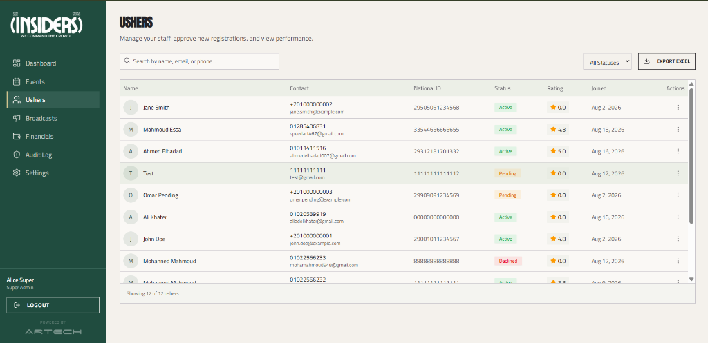
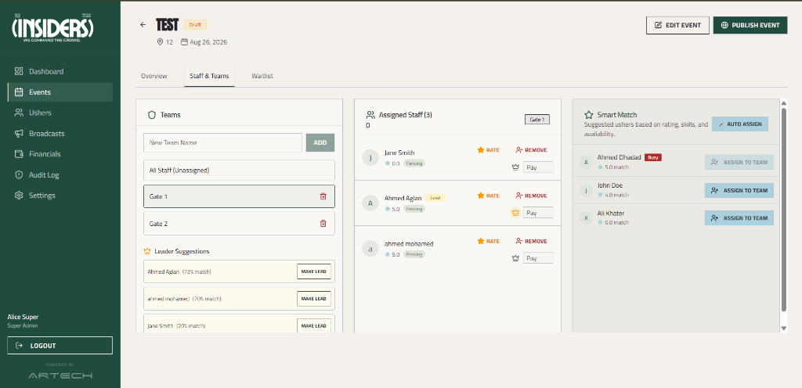
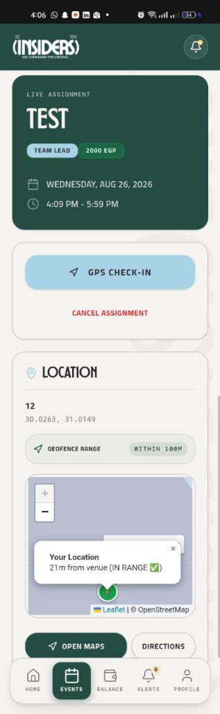
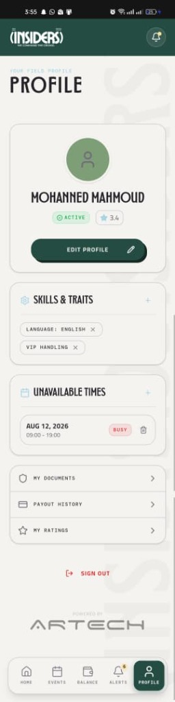
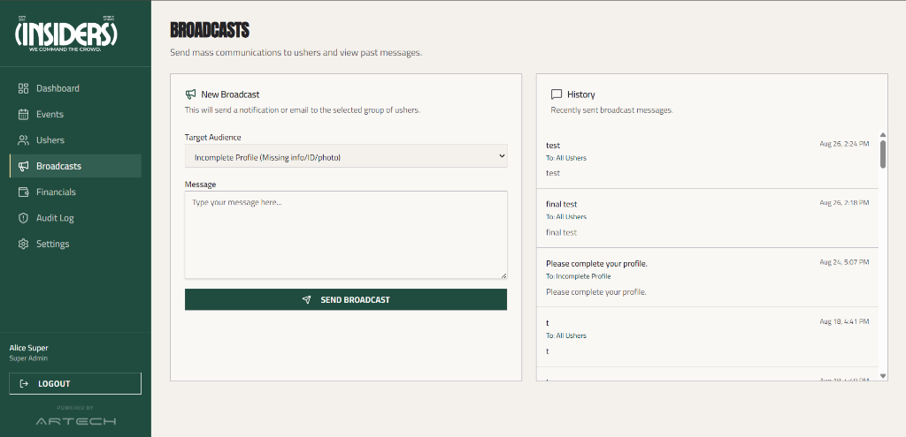
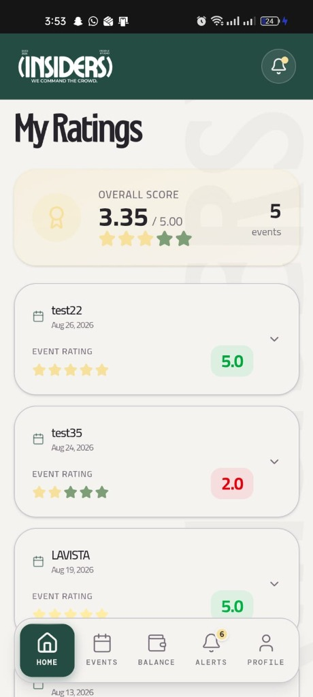
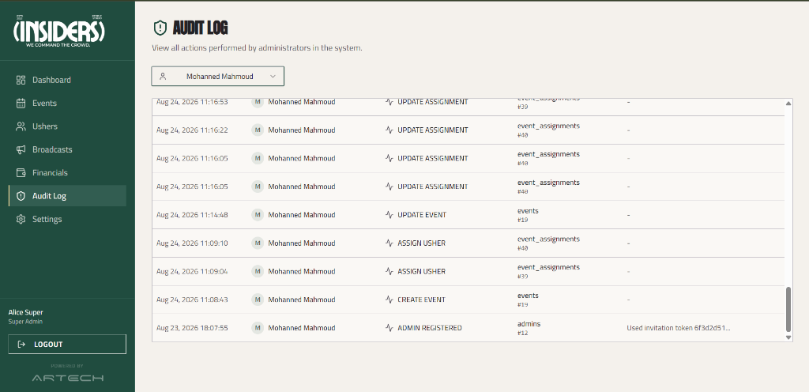

  
  <h1>INSIDERS</h1>
  
<strong>We Command The Crowd.</strong>

## Table of Contents
- [Introduction](#introduction)
- [The Problem It Solves](#the-problem-it-solves)
- [Who Uses It](#who-uses-it)
- [Key Features](#key-features)
- [How It Works (User Journey)](#how-it-works-user-journey)
- [Branding](#branding)
- [Contact & Support](#contact--support)

---

## Introduction
Welcome to **INSIDERS** — a premier event staffing and usher management platform designed to command the crowd with efficiency and elegance. Whether you are an event organizer looking to coordinate hundreds of staff members, or an usher seeking your next high-profile assignment, INSIDERS provides a seamless, digital-first experience tailored to the events industry.

## The Problem It Solves
Managing event staff manually through spreadsheets, chat groups, and paper sign-in sheets is chaotic, error-prone, and time-consuming. INSIDERS was built to eliminate this friction. It acts as a centralized hub for tracking usher availability, assigning shifts, ensuring punctuality via GPS check-ins, monitoring budgets, and collecting performance ratings — all in real-time.

## Who Uses It

### 📱 Ushers (Mobile App)
The frontline ambassadors of any event. Through the dedicated mobile application, ushers can:
- Register and submit their documents for approval.
- Manage their availability and highlight their unique skills (e.g., languages, VIP handling).
- Receive, accept, or decline event assignments.
- Check in and out of events using location-based verification.
- Track their payouts and view performance ratings.

### 💻 Admins & Organizers (Admin Dashboard)
The control center for event managers. Through the web-based admin panel, organizers can:
- Create new events, set locations, and define budgets.
- Browse usher profiles, filter by skills or ratings, and assign them to events.
- Track live attendance and handle "no-shows" or late arrivals.
- Review and approve new usher applications.
- Send broadcast announcements and monitor the system audit log.
- *(Super Admins)* Oversee financial payouts and platform-wide configurations.

---

## Key Features

### Usher Registration & Approval
A streamlined onboarding process where ushers can sign up, upload their identification, and await verification. Admins can review pending applications to ensure only qualified staff join the platform.

### Event Assignments
Admins can select ushers for upcoming events based on smart suggestions, availability, and past ratings. Ushers receive instant notifications and can accept or decline the shift directly from their app.

### GPS-Verified Check-in/Check-out
To ensure punctuality and attendance, ushers use the app to check in and out of their shifts. The system verifies their GPS location against the event venue, preventing fraudulent check-ins.

### Profile & Skills Management
Ushers can build their digital resume by adding their skills, traits, and languages. They can also mark days they are unavailable, ensuring admins only invite them when they are free to work.

### Comprehensive Admin Dashboard
A high-level view of active events, pending approvals, and system health. Organizers can dive into specific events to monitor budget usage and staff attendance in real-time.

### Broadcasts & Communications
Need to send an urgent update to all staff or a specific team? Admins can push broadcast messages that instantly notify the relevant ushers.

### Ratings & Feedback
After an event, clients and team leaders can rate the ushers. The system also automatically calculates punctuality scores, ensuring the best staff are prioritized for future events.

### Audit Log & Accountability
Every critical action on the platform—from assigning an usher to modifying a budget—is recorded in a secure audit log for complete transparency and accountability.

---

## How It Works (User Journey)

### The Usher's Journey
1. **Sign Up:** Sarah downloads the INSIDERS app, creates an account, and uploads her ID.
2. **Onboarding:** An admin reviews her profile and approves her account.
3. **Getting Booked:** Sarah sets her skills (fluent in French, VIP Handling) and marks her available days. She soon receives a notification: *"You've been assigned to the Tech Summit!"*
4. **The Event:** On the day of the event, Sarah arrives at the venue and taps **Check In** on her app. The app verifies she is at the correct location.
5. **Wrapping Up:** When her shift ends, she taps **Check Out**. Later that week, she checks her app to see her 5-star rating and her updated payout balance.

### The Admin's Journey
1. **Planning:** Ahmed is organizing a large conference. He logs into the Admin Dashboard, creates the "Global Tech Summit" event, sets the venue location, and assigns a budget.
2. **Staffing:** He opens the event and uses the *Smart Match* feature to find 50 available ushers with high ratings and specific language skills. He assigns them with one click.
3. **Live Monitoring:** On the day of the summit, Ahmed watches the dashboard as ushers check in. He notices two ushers are running late and easily reassigns a backup usher from the waitlist.
4. **Post-Event:** After a successful event, Ahmed reviews the automated punctuality deductions and finalizes the payouts for all staff.

---

## Branding
INSIDERS is built around a sleek, premium, and minimalistic visual identity. The platform heavily utilizes a striking contrast of deep blacks and sharp whites, accented with bold typography. This reflects our core philosophy: professionalism, authority, and elegance. 

---

## Contact & Support
For support, inquiries, or feature requests, please reach out to the management team.

- **Email:** support@insiders.com *(Placeholder)*
- **Phone:** +20 100 000 0000 *(Placeholder)*
- **Website:** www.insiders.com *(Placeholder)*
